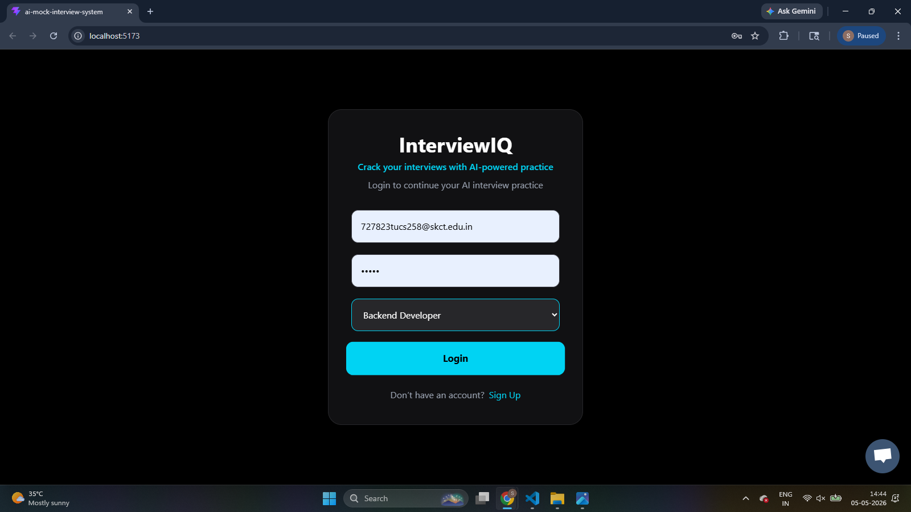
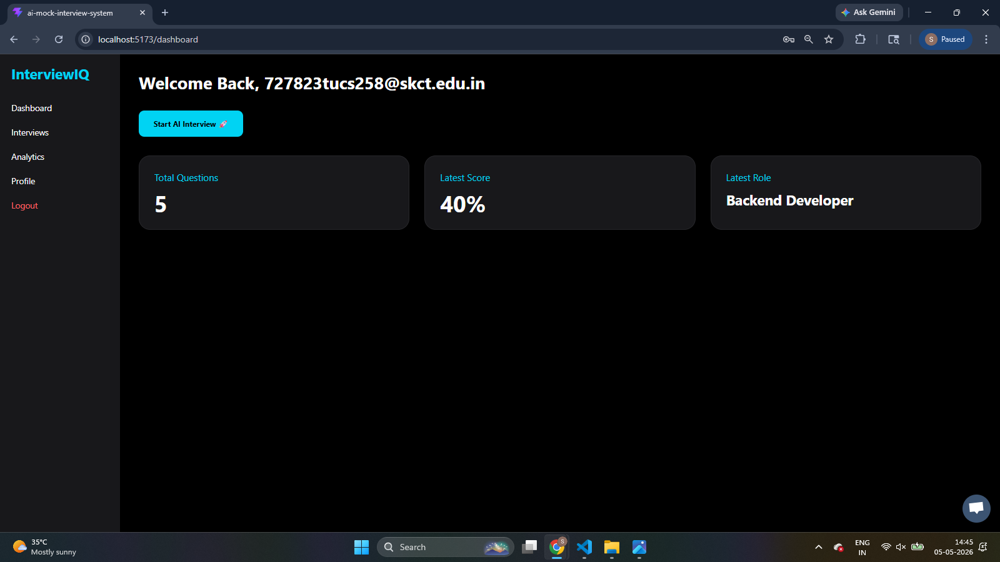
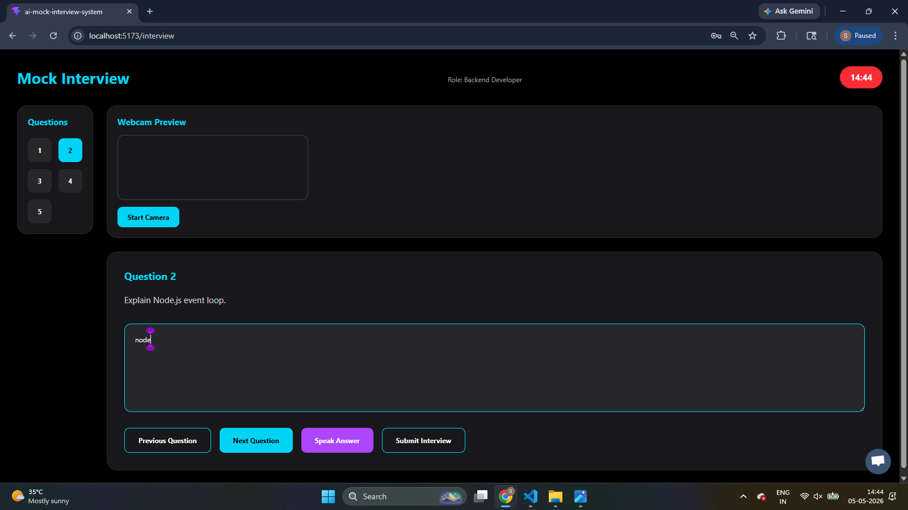
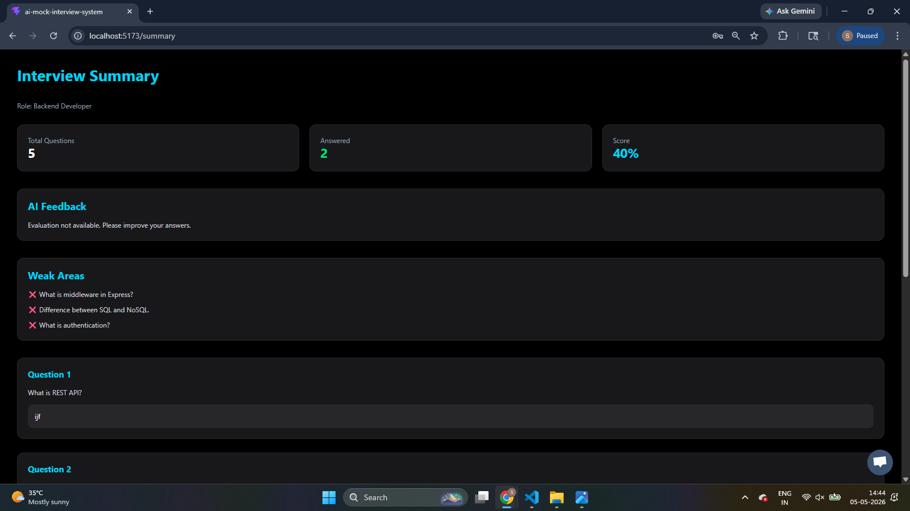
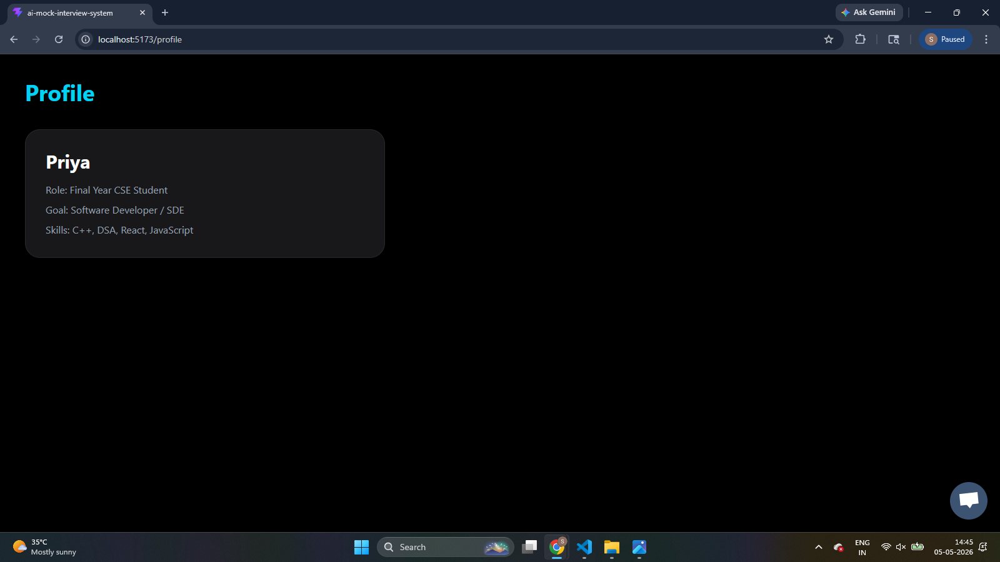
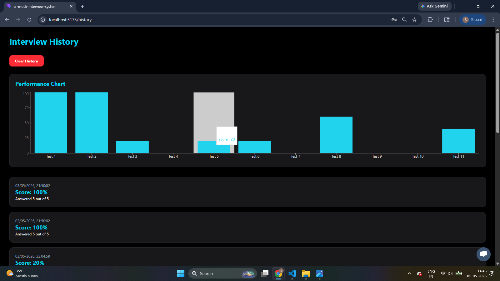

# InterviewIQ 

AI-powered mock interview platform with role-based questions, voice input, analytics dashboard, and MongoDB backend.

## Features
- Role-based interview questions
- Voice input support
- AI feedback (with fallback)
- Webcam simulation
- Timer-based interview
- Performance analytics
- MongoDB storage

## Tech Stack
- Frontend: React, Tailwind CSS
- Backend: Node.js, Express
- Database: MongoDB
- AI: OpenAI API

## 📸 Screenshots

### 🔐 Login Page

### 📊 Dashboard

### 🎤 Interview Page

### 📄 Summary Page

### 📄 Profile Page

### 📄 Analytics Page

## How to Run

Frontend:

cd "AI-Mock-Interview-System"

npm run dev

Backend:

cd backend

node server.cjs
